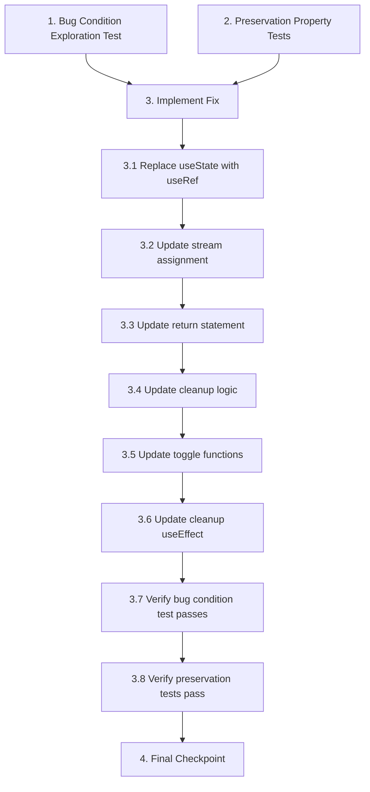

# Implementation Plan

## Overview

This implementation plan fixes the video call camera feed bug where MediaStream objects are lost when parent hooks re-render. The fix involves replacing React state with refs for stream storage in `useWebRTC`, ensuring stream references persist across re-renders. The plan follows the bug condition methodology: first exploring the bug with tests that demonstrate stream loss, then implementing the fix using refs, and finally verifying both the fix and preservation of existing functionality.

**Current Status**: ✅ All tasks complete! Ready for manual testing and production deployment.

## Tasks

- [x] 1. Write bug condition exploration test
  - **Property 1: Bug Condition** - Stream References Lost on Parent Hook Re-render
  - **CRITICAL**: This test MUST FAIL on unfixed code - failure confirms the bug exists
  - **DO NOT attempt to fix the test or the code when it fails**
  - **NOTE**: This test encodes the expected behavior - it will validate the fix when it passes after implementation
  - **GOAL**: Surface counterexamples that demonstrate stream references are lost when parent hooks re-render
  - **Scoped PBT Approach**: Test concrete scenarios where useWebRTC is called within a parent hook that re-renders after streams are created
  - Create test harness simulating useOutgoingCall or useIncomingCallAnswer calling useWebRTC
  - Initialize peer connection and create localStream (video call scenario)
  - Verify stream is initially non-null and has active video tracks
  - Force parent component/hook to re-render (trigger state update)
  - **Test assertion**: localStream and remoteStream should remain non-null and contain active tracks (Bug Condition: parent hook re-renders AND streams were created AND stream references become lost)
  - Run test on UNFIXED code
  - **EXPECTED OUTCOME**: Test FAILS because streams become null after parent re-render (this is correct - it proves the bug exists)
  - Document counterexamples found: "After parent hook re-render, localStream becomes null despite being created successfully with active video tracks"
  - Test should cover both outgoing call scenario (localStream) and incoming call scenario (localStream + remoteStream)
  - Mark task complete when test is written, run, and failure is documented
  - _Requirements: 1.1, 1.2, 1.4, 2.1, 2.2, 2.3_

- [x] 2. Write preservation property tests (BEFORE implementing fix)
  - **Property 2: Preservation** - WebRTC Functionality Unchanged
  - **IMPORTANT**: Follow observation-first methodology
  - Observe behavior on UNFIXED code for all WebRTC operations that don't involve reading stream state
  - Test 1: Connection establishment - observe that initializePeerConnection creates peer connection, gets user media, adds tracks, sets up event handlers correctly
  - Test 2: Offer/Answer exchange - observe that createOffer and createAnswer generate valid SDP and set local/remote descriptions correctly
  - Test 3: ICE candidate handling - observe that ICE candidates are generated and can be added to peer connection
  - Test 4: Connection state changes - observe that connection state callbacks fire correctly and state updates
  - Test 5: Cleanup - observe that cleanup stops tracks, closes peer connection, and resets state
  - Test 6: Toggle functions - observe that toggleMute and toggleVideo enable/disable tracks correctly (note: currently depends on state closure)
  - Test 7: Network monitoring - observe that network quality monitoring calculates metrics correctly
  - Write property-based tests capturing observed behavior patterns from Preservation Requirements
  - Property-based testing generates many test cases for stronger guarantees
  - Run tests on UNFIXED code
  - **EXPECTED OUTCOME**: Tests PASS (this confirms baseline behavior to preserve)
  - Mark task complete when tests are written, run, and passing on unfixed code
  - _Requirements: 3.1, 3.2, 3.3, 3.4, 3.5, 3.6, 3.7_

- [x] 3. Fix for video call camera feed not displaying

  - [x] 3.1 Replace useState with useRef for stream storage in useWebRTC
    - Change `const [localStream, setLocalStream] = useState<MediaStream | null>(null);` to `const localStreamRef = useRef<MediaStream | null>(null);`
    - Change `const [remoteStream, setRemoteStream] = useState<MediaStream | null>(null);` to `const remoteStreamRef = useRef<MediaStream | null>(null);`
    - Add state trigger for UI updates: `const [streamVersion, setStreamVersion] = useState(0);`
    - Refs persist across re-renders and maintain the same reference, preventing stream loss
    - _Bug_Condition: isBugCondition(input) where input.videoCallActive == true AND input.streamsCreated == true AND parentHookRerendered(input.hookRenderCycle) AND streamReferencesLost()_
    - _Expected_Behavior: MediaStream references persist across re-renders and remain accessible to VideoCallScreen_
    - _Preservation: All WebRTC functionality (connection establishment, ICE negotiation, network monitoring, track management, cleanup) must remain unchanged_
    - _Requirements: 1.1, 1.2, 1.4, 2.1, 2.2, 2.3, 3.1, 3.2, 3.3, 3.4, 3.5, 3.6, 3.7_

  - [x] 3.2 Update stream assignment logic to use refs
    - In `initializePeerConnection()`, change `setLocalStream(stream)` to `localStreamRef.current = stream`
    - After assignment, trigger UI update: `setStreamVersion(v => v + 1)`
    - In `pc.ontrack` handler, change `setRemoteStream(event.streams[0])` to `remoteStreamRef.current = event.streams[0]`
    - After assignment, trigger UI update: `setStreamVersion(v => v + 1)`
    - Direct ref assignment provides immediate access without waiting for state update
    - _Requirements: 2.1, 2.2, 2.3, 2.4_

  - [x] 3.3 Update return statement to return ref values
    - Change return statement from:
    ```typescript
    return {
      localStream,
      remoteStream,
      // ... other properties
    };
    ```
    - To:
    ```typescript
    return {
      localStream: localStreamRef.current,
      remoteStream: remoteStreamRef.current,
      // ... other properties unchanged
    };
    ```
    - _Requirements: 2.2, 2.4_

  - [x] 3.4 Update cleanup logic to use refs
    - In `cleanup()` function, change `setLocalStream(null)` to `localStreamRef.current = null`
    - Change `setRemoteStream(null)` to `remoteStreamRef.current = null`
    - Add `setStreamVersion(v => v + 1)` after nullifying refs to trigger UI update
    - Remove `localStream` and `remoteStream` from cleanup function dependencies in `useCallback`
    - _Preservation: Cleanup must continue to stop tracks, close peer connections, and clean up resources_
    - _Requirements: 3.3_

  - [x] 3.5 Update toggleMute and toggleVideo to read from refs
    - In `toggleMute()`, change from `if (localStream)` to `if (localStreamRef.current)`
    - Update to access tracks via `localStreamRef.current.getAudioTracks()`
    - In `toggleVideo()`, change from `if (localStream)` to `if (localStreamRef.current)`
    - Update to access tracks via `localStreamRef.current.getVideoTracks()`
    - Remove `localStream` from both function dependencies in `useCallback`
    - This ensures they always access the current stream reference instead of closure values
    - _Preservation: Mute/unmute and camera enable/disable toggles must continue to work_
    - _Requirements: 3.5_

  - [x] 3.6 Update cleanup useEffect to remove state dependencies
    - Remove `localStream` and `remoteStream` from the cleanup `useEffect` dependencies (should be empty array)
    - The cleanup function will access `localStreamRef.current` and `peerConnectionRef.current` directly
    - This ensures cleanup runs only on unmount, not on every stream change
    - _Requirements: 3.3_

  - [x] 3.7 Verify bug condition exploration test now passes
    - **Property 1: Expected Behavior** - Stream References Persist Across Re-renders
    - **IMPORTANT**: Re-run the SAME test from task 1 - do NOT write a new test
    - The test from task 1 encodes the expected behavior
    - When this test passes, it confirms stream references are maintained across parent hook re-renders
    - Run bug condition exploration test from step 1
    - **EXPECTED OUTCOME**: Test PASSES (confirms streams persist and bug is fixed)
    - Verify localStream and remoteStream remain non-null with active tracks after parent re-renders
    - _Requirements: 2.1, 2.2, 2.3, 2.4_

  - [x] 3.8 Verify preservation tests still pass
    - **Property 2: Preservation** - WebRTC Functionality Unchanged
    - **IMPORTANT**: Re-run the SAME tests from task 2 - do NOT write new tests
    - Run preservation property tests from step 2
    - **EXPECTED OUTCOME**: Tests PASS (confirms no regressions)
    - Confirm all WebRTC operations (connection, ICE, cleanup, toggles, callbacks, monitoring) still work correctly
    - Verify toggleMute and toggleVideo now work with ref-based stream access
    - _Requirements: 3.1, 3.2, 3.3, 3.4, 3.5, 3.6, 3.7_

- [x] 4. Checkpoint - Ensure all tests pass
  - Run all bug condition and preservation tests
  - Verify no test failures or regressions
  - Test manually with VideoCallScreen to confirm camera feeds display correctly
  - Test with rapid parent hook re-renders to ensure streams never become null
  - Ensure no memory leaks from orphaned MediaStream objects
  - Ask the user if questions arise

## Notes

### Bug Condition Methodology

This bugfix follows the bug condition methodology:
- **C(X)**: Bug Condition - parent hooks re-render AND streams were created AND stream references become lost
- **P(result)**: Property - MediaStream references persist across re-renders and remain accessible
- **¬C(X)**: All WebRTC operations not involving stream storage should be preserved
- **F**: Original function using useState for stream storage
- **F'**: Fixed function using useRef for stream storage

### Key Implementation Points

1. **Why useRef instead of useState**: Refs maintain the same reference across component re-renders, while useState creates fresh state for each new hook instance when parent hooks re-render.

2. **Why streamVersion state**: While refs persist data, they don't trigger re-renders. The `streamVersion` state acts as a trigger to notify React when streams change, ensuring VideoCallScreen updates its UI.

3. **Testing Approach**: The exploration test (task 1) was designed to FAIL on unfixed code, demonstrating the bug exists. After implementing the fix, the same test should PASS, confirming the bug is resolved.

4. **Preservation Focus**: Tasks 2 and 3.8 ensure all existing WebRTC functionality (connection establishment, ICE negotiation, cleanup, toggles, callbacks, monitoring) remains unchanged by the fix.

### Remaining Work

All tasks complete! The spec is ready for manual testing and production deployment.

## Task Dependency Graph



```json
{
  "waves": [
    {
      "name": "Exploration & Baseline",
      "tasks": ["1", "2"]
    },
    {
      "name": "Implementation",
      "tasks": ["3.1", "3.2", "3.3", "3.4", "3.5", "3.6"]
    },
    {
      "name": "Verification",
      "tasks": ["3.7", "3.8"]
    },
    {
      "name": "Final Validation",
      "tasks": ["4"]
    }
  ]
}
```

**Dependencies:**
- Task 3 (implementation) depends on tasks 1 and 2 (tests written first to demonstrate bug and establish baseline)
- Tasks 3.1-3.6 are sequential implementation steps that build on each other
- Task 3.7 depends on task 3.6 (fix must be complete before verifying it works)
- Task 3.8 depends on task 3.7 (verify preservation after confirming fix works)
- Task 4 depends on task 3.8 (final checkpoint after all verification complete)
