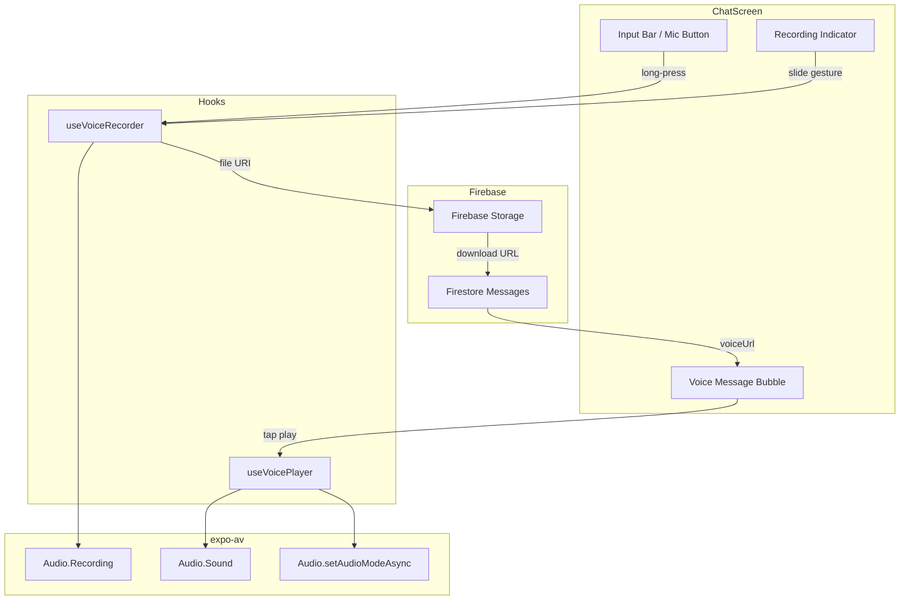
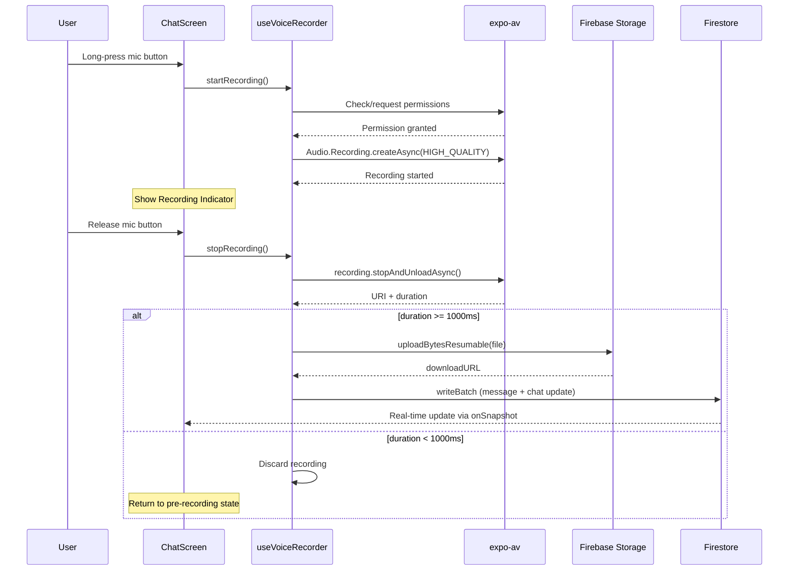
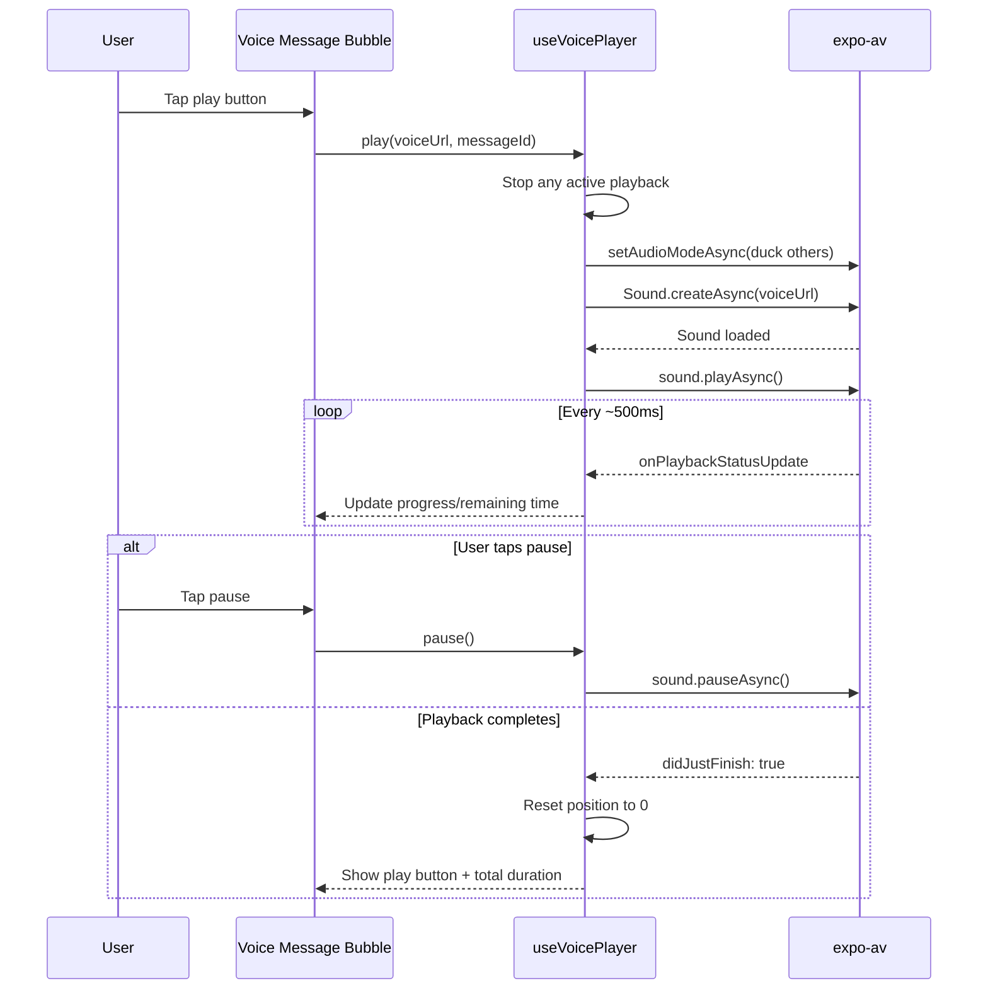

# Design Document: Voice Notes

## Overview

Voice Notes adds audio messaging to Chit-Chat, enabling users to record, send, and play back voice messages within existing chat conversations. The feature integrates with the current Firestore messaging infrastructure and adds three new capabilities:

1. **Audio Recording** — Press-and-hold to record with slide-to-cancel gesture, using `expo-av` Audio Recording API
2. **Cloud Storage** — Upload recorded audio files to Firebase Storage, storing the download URL in the message document
3. **Audio Playback** — Inline playback with animated waveform progress, pause/resume, and single-active-player management

The design leverages the existing patterns in the codebase: custom hooks for state management, `writeBatch` for atomic Firestore operations, and the existing message bubble UI structure in `ChatScreen.tsx`.

### Key Technical Decisions

| Decision | Choice | Rationale |
|----------|--------|-----------|
| Audio library | `expo-av` (Audio) | Still bundled in SDK 54; `expo-audio` is the successor but `expo-av` is stable and well-documented for this SDK version |
| Audio format | AAC in `.m4a` container | Cross-platform, hardware-accelerated encode/decode on both iOS and Android |
| Storage path | `voiceNotes/{chatId}/{messageId}.m4a` | Scoped to chat for easy security rules, unique per message |
| Gesture handling | React Native `PanResponder` | Built-in, no extra dependencies; sufficient for slide-to-cancel at 50dp threshold |
| State management | Custom hooks (`useVoiceRecorder`, `useVoicePlayer`) | Consistent with existing hook patterns (`useMessages`, `useChats`) |

---

## Architecture

### High-Level System Diagram



### Data Flow: Recording & Sending



### Data Flow: Playback



---

## Components and Interfaces

### New Files

| File | Purpose |
|------|---------|
| `src/hooks/useVoiceRecorder.ts` | Recording lifecycle, permissions, file management |
| `src/hooks/useVoicePlayer.ts` | Playback management, audio session, single-active-player |
| `src/components/VoiceRecordingOverlay.tsx` | Recording indicator with timer and slide-to-cancel hint |
| `src/components/VoiceMessageBubble.tsx` | Playback UI with waveform, play/pause, duration |
| `src/utils/voiceNoteStorage.ts` | Firebase Storage upload with progress tracking |

### Modified Files

| File | Changes |
|------|---------|
| `src/screens/ChatScreen.tsx` | Add PanResponder to mic button, integrate recording overlay, use VoiceMessageBubble for voice messages |
| `src/screens/ChatsScreen.tsx` | Show mic icon + "Voice Note" for voice message previews |
| `src/hooks/useMessages.ts` | Add `sendVoiceMessage()` function |
| `src/hooks/useChatActions.ts` | Add `sendVoiceMessage()` with batch write |
| `src/config/firebase.ts` | Export `getStorage` instance |
| `package.json` | Add `expo-av` dependency |
| `app.json` | Add microphone permission for Android, `expo-av` plugin |

---

### Hook: `useVoiceRecorder`

```typescript
interface RecordingState {
  status: 'idle' | 'requesting-permission' | 'recording' | 'cancelled' | 'stopped';
  durationMs: number;
  metering: number;        // dB level for visual feedback
  isWarning: boolean;      // true when duration >= 110s
  permissionDenied: boolean;
  permissionDeniedPermanently: boolean;
}

interface UseVoiceRecorderReturn {
  state: RecordingState;
  startRecording: () => Promise<void>;
  stopRecording: () => Promise<RecordingResult | null>;
  cancelRecording: () => Promise<void>;
}

interface RecordingResult {
  uri: string;
  durationMs: number;
  fileSize: number;
}
```

**Key Implementation Details:**

- Uses `Audio.Recording.createAsync(RecordingOptionsPresets.HIGH_QUALITY)` — produces AAC `.m4a`
- `setProgressUpdateInterval(1000)` for 1-second timer updates
- `onRecordingStatusUpdate` callback updates `durationMs` and `metering`
- Automatic stop at 120,000ms via duration check in status callback
- Warning state triggered at 110,000ms
- On cancel: calls `stopAndUnloadAsync()` then deletes the local file
- Minimum duration check (1000ms) happens in `stopRecording()` — returns `null` if too short

### Hook: `useVoicePlayer`

```typescript
interface PlaybackState {
  activeMessageId: string | null;
  status: 'idle' | 'loading' | 'playing' | 'paused' | 'error';
  positionMs: number;
  durationMs: number;
  error: string | null;
}

interface UseVoicePlayerReturn {
  state: PlaybackState;
  play: (voiceUrl: string, messageId: string, durationMs: number) => Promise<void>;
  pause: () => Promise<void>;
  resume: () => Promise<void>;
  stop: () => Promise<void>;
}
```

**Key Implementation Details:**

- Maintains a single `Audio.Sound` instance ref — only one voice note plays at a time
- Before playing a new note, stops and unloads the previous sound
- Configures audio mode on play:
  ```typescript
  await Audio.setAudioModeAsync({
    allowsRecordingIOS: false,
    playsInSilentModeIOS: true,
    staysActiveInBackground: false,
    interruptionModeIOS: InterruptionModeIOS.DuckOthers,
    interruptionModeAndroid: InterruptionModeAndroid.DuckOthers,
    shouldDuckAndroid: true,
  });
  ```
- `onPlaybackStatusUpdate` at default 500ms interval updates position for waveform progress
- On `didJustFinish`: resets position to 0, shows play button, displays total duration
- Cleanup on unmount: unloads sound, resets audio mode
- Exposes `stop()` for navigation cleanup (called from `useEffect` cleanup in ChatScreen)

### Component: `VoiceRecordingOverlay`

```typescript
interface VoiceRecordingOverlayProps {
  durationMs: number;
  isWarning: boolean;
  onCancel: () => void;
}
```

- Renders over the input bar area during recording
- Shows pulsing red dot + elapsed time in `MM:SS` format
- Shows "Slide to cancel" hint with animated chevron
- At 110s+, changes background/text to warning color (orange/red)
- At 120s, displays brief "Maximum duration reached" toast

### Component: `VoiceMessageBubble`

```typescript
interface VoiceMessageBubbleProps {
  messageId: string;
  voiceUrl: string;
  durationMs: number;
  isOutgoing: boolean;
  playerState: PlaybackState;
  onPlay: () => void;
  onPause: () => void;
}
```

- Play/pause button (circular, 32x32)
- Waveform bars (20 bars, heights derived from a deterministic seed based on messageId)
- Progress fill: left-to-right colored overlay based on `positionMs / durationMs`
- Duration label: shows remaining time (`durationMs - positionMs`) during playback, total duration when idle
- Loading spinner replaces play button during `status === 'loading'`
- Error state: retry button + "Voice note unavailable" text

### Utility: `voiceNoteStorage.ts`

```typescript
interface UploadProgress {
  bytesTransferred: number;
  totalBytes: number;
  percentage: number;
}

interface UploadResult {
  downloadUrl: string;
  storagePath: string;
}

function uploadVoiceNote(
  uri: string,
  chatId: string,
  messageId: string,
  onProgress: (progress: UploadProgress) => void,
): Promise<UploadResult>;
```

**Implementation:**

```typescript
import { getStorage, ref, uploadBytesResumable, getDownloadURL } from 'firebase/storage';
import app from '../config/firebase';

const storage = getStorage(app);

async function uploadVoiceNote(uri, chatId, messageId, onProgress) {
  const storagePath = `voiceNotes/${chatId}/${messageId}.m4a`;
  const storageRef = ref(storage, storagePath);

  // Read file as blob
  const response = await fetch(uri);
  const blob = await response.blob();

  // Check file size (10 MB limit)
  if (blob.size > 10 * 1024 * 1024) {
    throw new Error('RECORDING_TOO_LARGE');
  }

  const uploadTask = uploadBytesResumable(storageRef, blob, {
    contentType: 'audio/mp4',
  });

  return new Promise((resolve, reject) => {
    const timeout = setTimeout(() => {
      uploadTask.cancel();
      reject(new Error('UPLOAD_TIMEOUT'));
    }, 30000);

    uploadTask.on('state_changed',
      (snapshot) => {
        onProgress({
          bytesTransferred: snapshot.bytesTransferred,
          totalBytes: snapshot.totalBytes,
          percentage: Math.round((snapshot.bytesTransferred / snapshot.totalBytes) * 100),
        });
      },
      (error) => {
        clearTimeout(timeout);
        reject(error);
      },
      async () => {
        clearTimeout(timeout);
        const downloadUrl = await getDownloadURL(uploadTask.snapshot.ref);
        resolve({ downloadUrl, storagePath });
      },
    );
  });
}
```

### Modified: `sendVoiceMessage` in `useChatActions.ts`

```typescript
async function sendVoiceMessage(
  chatId: string,
  senderId: string,
  voiceUrl: string,
  durationMs: number,
): Promise<{ success: boolean; messageId: string }> {
  const chatRef = doc(db, 'chats', chatId);
  const chatSnap = await getDoc(chatRef);
  if (!chatSnap.exists()) return { success: false, messageId: '' };

  const members: string[] = chatSnap.data().members ?? [];
  const otherMembers = members.filter((id) => id !== senderId);

  const batch = writeBatch(db);

  // 1. Create message document
  const msgRef = doc(collection(db, 'chats', chatId, 'messages'));
  batch.set(msgRef, {
    messageId: msgRef.id,
    senderId,
    text: null,
    imageUrl: null,
    voiceUrl,
    type: 'voice',
    duration: durationMs,
    timestamp: serverTimestamp(),
    readBy: [senderId],
  });

  // 2. Update chat lastMessage + increment unread for others
  const unreadUpdates = Object.fromEntries(
    otherMembers.map((id) => [`unreadCounts.${id}`, increment(1)])
  );

  batch.update(chatRef, {
    'lastMessage.text': '[Voice Note]',
    'lastMessage.senderId': senderId,
    'lastMessage.timestamp': serverTimestamp(),
    ...unreadUpdates,
  });

  await batch.commit();
  return { success: true, messageId: msgRef.id };
}
```

---

## Data Models

### Firestore: Message Document (Voice Type)

```typescript
// chats/{chatId}/messages/{messageId}
interface VoiceMessageDocument {
  messageId:  string;
  senderId:   string;
  text:       null;
  imageUrl:   null;
  voiceUrl:   string;      // Firebase Storage download URL
  type:       'voice';
  duration:   number;      // milliseconds (1000–120000)
  timestamp:  Timestamp;   // serverTimestamp()
  readBy:     string[];    // [senderId] initially
}
```

### Firestore: Chat Document (lastMessage for Voice)

```typescript
// chats/{chatId} - lastMessage field when last message is voice
interface ChatLastMessage {
  text:      string;    // "[Voice Note]"
  senderId:  string;
  timestamp: Timestamp;
}
```

### Firebase Storage Path

```
voiceNotes/{chatId}/{messageId}.m4a
```

- Content type: `audio/mp4`
- Max file size: 10 MB
- Security rules: Only chat members can read; only authenticated users who are chat members can write

### Local Recording State (ephemeral, not persisted)

```typescript
interface PendingVoiceMessage {
  localUri: string;        // expo-av recording output path
  durationMs: number;
  chatId: string;
  uploadProgress: number;  // 0-100
  retryCount: number;      // max 3
  status: 'uploading' | 'failed' | 'sent';
}
```

### Updated `FireMessage` Interface

```typescript
// In useMessages.ts - add duration field
export interface FireMessage {
  messageId:  string;
  senderId:   string;
  text:       string | null;
  imageUrl:   string | null;
  voiceUrl:   string | null;
  type:       'text' | 'image' | 'voice';
  duration:   number | null;   // NEW: milliseconds for voice messages
  timestamp:  Date | null;
  readBy:     string[];
}
```

---

